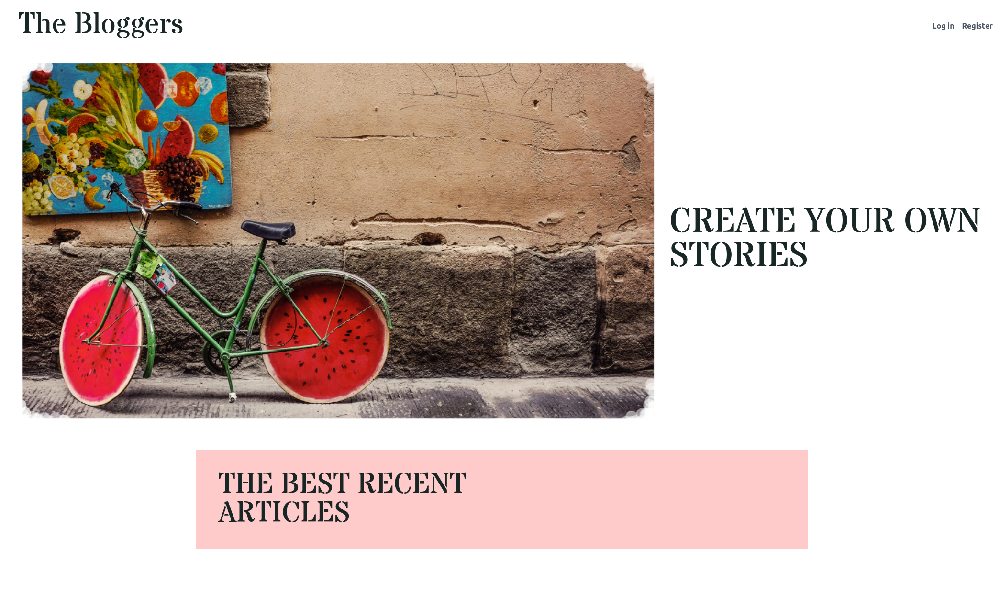
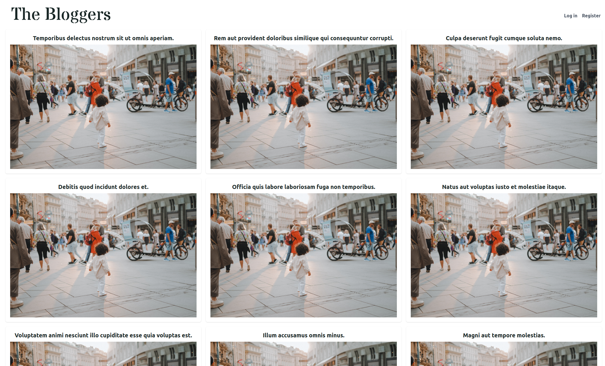
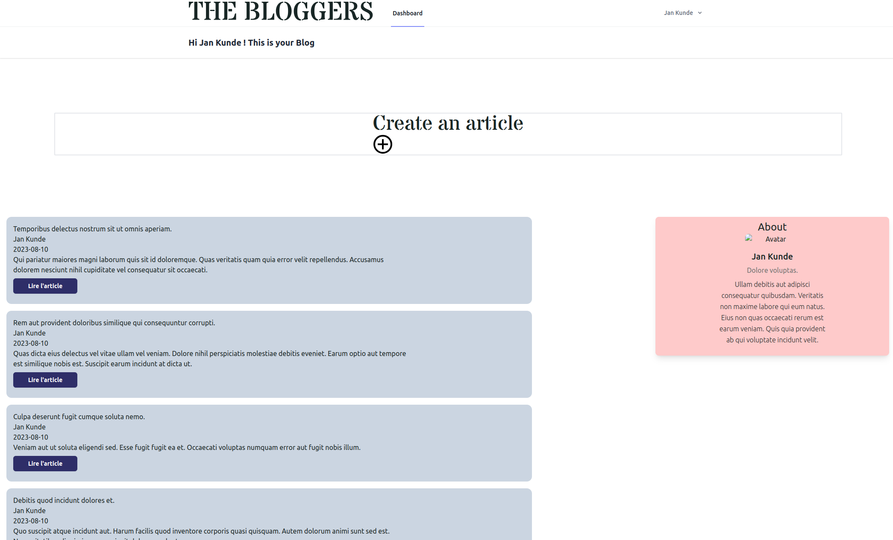
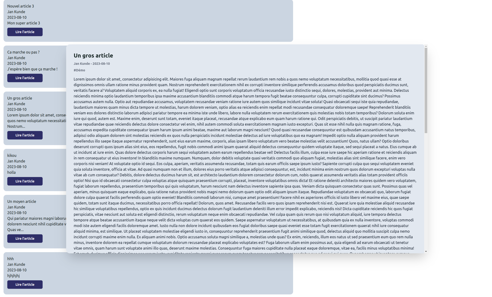
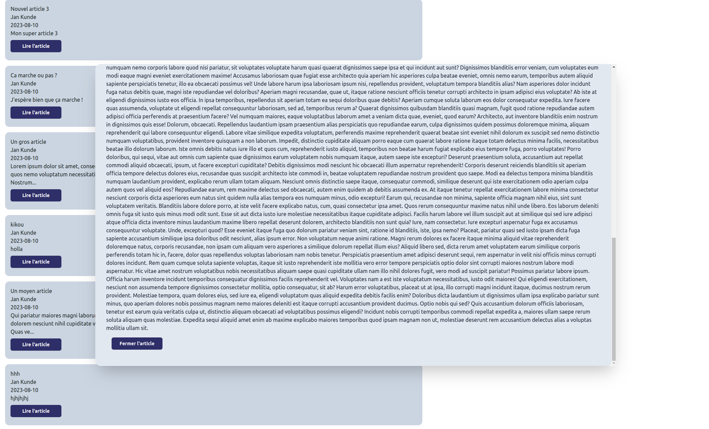
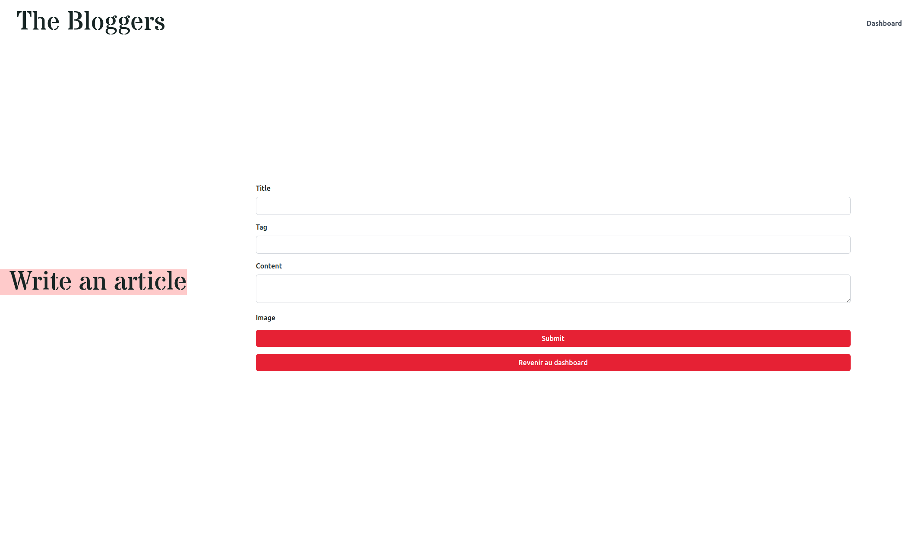

# La plateforme de blog

## Stack utilisée

Le projet utilise le framework Laravel bien évidemment. Nous avons décidé d'utiliser React pour la partie Front du projet. La base de donnée est en postgreSQL et nous gérons la base avec pgAdmin. 

Pour lancer le projet, il faut utiliser la commande dans le container de l'application Laravel :

``` 
npm run dev 
```

## Version 1.0 du projet

Dans un premier temps, voici la base du produit qu'il fallait atteindre, avec :

- une page d’inscription et de connexion,
- une page de profil avec votre biographie et vos posts,
- une page d’édition de votre profil,
- un formulaire de création de nouveau post,
- une page de visualisation de tous les posts de la plateforme, qui sera la page d’accueil.

## Version 1.1 & 1.2

Si nous avions eu plus de temps et une meilleure compréhension des installations et configurations sur les différents environnement de travail nous aurions eu à développer les fonctionnalités suivantes :

Pour la V. 1.1 :

- implémenter une pagination,
- implémenter un outil de recherche par filtre,
- écrire des relations entre modèles plus avancées.

Pour la V. 1.2 :

- Implémenter un *lazy loading*,
- Implémenter des tests de navigateurs,
- Créer un moteur de recommandation simple, basé sur l’analyse textuelle ou visuelle.

## La version actuelle du projet

Nous avons pu remplir les conditions de la V. 1.0

Voici des captures d'écran de notre site web.

La page d'accueil :




Le dashboard du user :



Une vision de l'article :




Et le formulaire de création :


